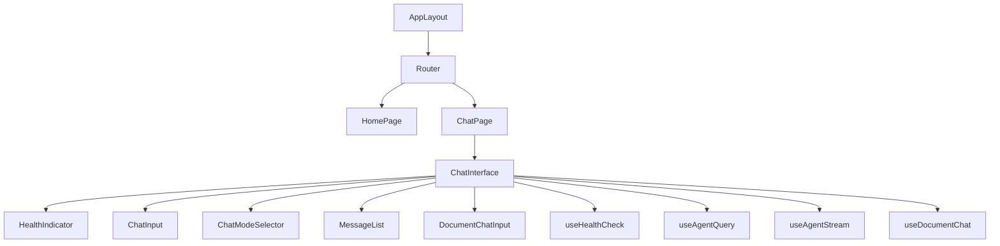

# Design: Build Chat Page

## Architecture Overview

A new chat page route (`/chat`) following the same component composition pattern as the existing home page. The page composes a `ChatInterface` component that integrates all four RAG hooks (`useHealthCheck`, `useAgentQuery`, `useAgentStream`, `useDocumentChat`) with a mode selector to switch between streaming and non-streaming agent queries.



## Directory Structure

```
src/
  app/
    page.tsx                         (existing - home)
    chat/
      page.tsx                       (new - renders Chat page)
  components/
    pages/
      Home.tsx                       (existing)
      Chat.tsx                       (new - composes ChatInterface + layout)
    chat/
      ChatInterface.tsx              (new - main chat logic + hook integration)
      ChatModeSelector.tsx           (new - "No Stream" / "Stream" toggle)
      ChatInput.tsx                  (new - message input + send button)
      MessageList.tsx                (new - displays conversation messages)
      HealthIndicator.tsx            (new - health check status pill)
      DocumentChatInput.tsx          (new - document ID input + chat)
```

## Component / Module Map

- `src/app/chat/page.tsx` — Route entry point, renders `Chat` page component
- `src/components/pages/Chat.tsx` — Composes `Header`, `ChatInterface`, `Footer`
- `src/components/chat/ChatInterface.tsx` — Owns chat state, integrates all hooks, manages mode switching
- `src/components/chat/ChatModeSelector.tsx` — Dropdown/button toggle between "No Stream" and "Stream"
- `src/components/chat/ChatInput.tsx` — Text input with send button, validates query (FR-002/003)
- `src/components/chat/MessageList.tsx` — Scrollable list of messages, handles loading/error/empty states (FR-006/007/008)
- `src/components/chat/HealthIndicator.tsx` — Calls `useHealthCheck`, displays green/red status pill (FR-005)
- `src/components/chat/DocumentChatInput.tsx` — Document ID + query input, calls `useDocumentChat` (FR-004)
- `src/app/page.tsx` — Updated to add a card linking to `/chat` (FR-001)

## State Management

All server state managed via TanStack React Query hooks. Component-local state for:
- `chatMode`: `"stream"` | `"nostream"` — current agent query mode
- `messages`: `Message[]` — conversation history (display only, not persisted)
- `inputValue`: `string` — current input text
- `documentId`: `string` — current document ID

## API Contracts

Reuses existing services and hooks from `integrate-rag-react-apis`:
- `useHealthCheck` — `GET /` → `HealthCheckResponse`
- `useAgentQuery` — `POST /api/v1/agent` → `AgentQueryResponse`
- `useAgentStream` — SSE `/api/v1/agent/stream?query=...` → chunks via `onChunk`
- `useDocumentChat` — `POST /api/documents/chat` → `DocumentChatResponse`

No new API contracts needed.

## Error Handling Strategy

- All hooks surface errors via `isError`/`error` properties
- `MessageList` renders per-message error indicators
- `ChatInterface` disables controls while a request is pending
- SSE stream errors shown inline with retry button (from `useAgentStream`)
- Network errors shown as banner above input area

## Data Flow

1. User navigates to `/` → sees landing page with card linking to `/chat`
2. User clicks card → navigates to `/chat` → `HealthIndicator` fires `useHealthCheck`
3. User selects chat mode ("No Stream" / "Stream") via `ChatModeSelector`
4. User types message and clicks Send:
   - **No Stream**: `useAgentQuery.mutate` → POST → display response in `MessageList`
   - **Stream**: `useAgentStream.startStream` → SSE → chunks update `streamedData` → displayed incrementally in `MessageList`
5. User optionally enters a Document ID and sends → `useDocumentChat.mutate` → POST with `documentId` + `query` → display response
6. On any error, `MessageList` shows the error message inline
