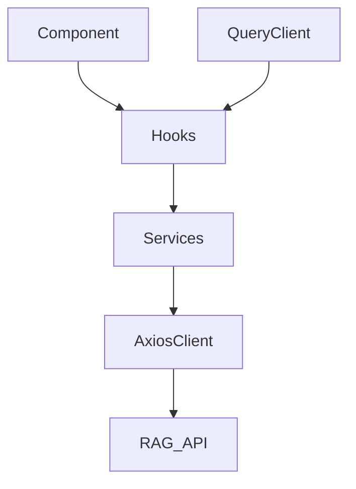

# Design: Integrate RAG React APIs

## Architecture Overview

A service layer wrapping the RAG React API, consumed via TanStack React Query hooks. Each endpoint maps to a dedicated custom hook. All API calls go through an **Axios** client instance. Each API category has a folder under `src/services/` with an `index.ts` (Axios calls) and `types/index.ts` (request/response interfaces). Hooks under `src/hooks/` (.tsx files) call service functions via `useQuery`/`useMutation`. The `QueryClientProvider` wraps the root layout.



## Directory Structure

```
src/
  services/
    health/
      index.ts
      types/
        index.ts
    agent/
      index.ts
      types/
        index.ts
    documents/
      index.ts
      types/
        index.ts
  hooks/
    useHealthCheck.tsx
    useAgentQuery.tsx
    useAgentStream.tsx
    useDocumentChat.tsx
  lib/
    axiosClient.ts
    queryClient.ts
  app/
    layout.tsx
```

## Predefined Folder / Files Mapping

### `src/services/` — Axios API execution layer (one folder per category)

| Folder | `index.ts` exports | `types/index.ts` exports |
|---|---|---|
| `health/` | Axios GET call to `/` | `HealthCheckResponse` |
| `agent/` | Axios POST to `/api/v1/agent` + SSE handling for `/api/v1/agent/stream` | `AgentQueryRequest`, `AgentQueryResponse` |
| `documents/` | Axios POST to `/api/documents/chat` | `DocumentChatRequest`, `DocumentChatResponse` |

### `src/hooks/` — React Query hooks (.tsx)

| File | Imports service from | Hook type |
|---|---|---|
| `useHealthCheck.tsx` | `services/health` | `useQuery` |
| `useAgentQuery.tsx` | `services/agent` | `useMutation` |
| `useAgentStream.tsx` | `services/agent` | Custom SSE hook with `useQuery` cache updates |
| `useDocumentChat.tsx` | `services/documents` | `useMutation` |

### `src/lib/` — Shared infrastructure

| File | Purpose |
|---|---|
| `axiosClient.ts` | Shared Axios instance, base URL from `NEXT_PUBLIC_API_BASE_URL`, error interceptors |
| `queryClient.ts` | `QueryClient` singleton with `staleTime`, `gcTime`, `retry` defaults |

### `src/app/`

| File | Purpose |
|---|---|
| `layout.tsx` | Wraps children in `QueryClientProvider` |

## Module Map

- `src/lib/axiosClient.ts` — shared Axios instance with base URL from `NEXT_PUBLIC_API_BASE_URL`, interceptors for error normalization
- `src/lib/queryClient.ts` — `QueryClient` singleton with defaults (`staleTime`, `gcTime`, `retry`)
- `src/services/health/index.ts` — Axios call for `GET /`, exports typed function
- `src/services/health/types/index.ts` — `HealthCheckResponse` interface
- `src/services/agent/index.ts` — Axios calls for `POST /api/v1/agent` and `/api/v1/agent/stream` (SSE), exports typed functions
- `src/services/agent/types/index.ts` — `AgentQueryRequest`, `AgentQueryResponse` interfaces
- `src/services/documents/index.ts` — Axios call for `POST /api/documents/chat`, exports typed function
- `src/services/documents/types/index.ts` — `DocumentChatRequest`, `DocumentChatResponse` interfaces
- `src/hooks/useHealthCheck.tsx` — `useQuery` consuming `services/health`
- `src/hooks/useAgentQuery.tsx` — `useMutation` consuming `services/agent`
- `src/hooks/useAgentStream.tsx` — SSE consumer hook with `useQuery` cache updates consuming `services/agent`
- `src/hooks/useDocumentChat.tsx` — `useMutation` consuming `services/documents`
- `src/app/layout.tsx` — wraps children in `QueryClientProvider`

## API Contracts

### Health Check
- **Service**: `services/health/index.ts`
- **Types**: `services/health/types/index.ts`
- **Hook**: `useHealthCheck.tsx`
- **Method**: GET
- **Path**: `/`
- **Response**: `HealthCheckResponse`
- **Errors**: Network failure

### Agent Query
- **Service**: `services/agent/index.ts`
- **Types**: `services/agent/types/index.ts`
- **Hook**: `useAgentQuery.tsx`
- **Method**: POST
- **Path**: `/api/v1/agent`
- **Request**: `AgentQueryRequest`
- **Response**: `AgentQueryResponse`
- **Errors**: 400 (invalid input), network failure

### Agent Stream (SSE)
- **Service**: `services/agent/index.ts`
- **Types**: `services/agent/types/index.ts`
- **Hook**: `useAgentStream.tsx`
- **Method**: POST
- **Path**: `/api/v1/agent/stream`
- **Request**: `AgentQueryRequest`
- **Response**: Server-Sent Events stream
- **Errors**: Connection drop, network failure

### Document Chat
- **Service**: `services/documents/index.ts`
- **Types**: `services/documents/types/index.ts`
- **Hook**: `useDocumentChat.tsx`
- **Method**: POST
- **Path**: `/api/documents/chat`
- **Request**: `DocumentChatRequest`
- **Response**: `DocumentChatResponse`
- **Errors**: 400 (invalid input), network failure

## Error Handling Strategy

- Axios interceptor normalizes errors into a consistent shape
- React Query captures errors in the `error` property of each hook
- Components read `isError` / `error` to surface messages
- SSE stream drops are caught in the hook and expose `isStreaming` / `streamError` state

## Data Flow

1. App mounts → `QueryClientProvider` initializes → Axios instance created with base URL
2. Health check component mounts → `useHealthCheck` fires `GET /` via Axios → result cached with long `staleTime`
3. User types a query → validates locally → calls `useAgentQuery.mutate` → Axios POST to `/api/v1/agent` → on success displays result, on error shows message
4. User requests streaming → `useAgentStream` opens SSE connection via Axios → chunks update `queryClient.setQueryData` incrementally → connection drop sets error state with retry via `refetch`
5. User sends document chat → validates → calls `useDocumentChat.mutate` → Axios POST to `/api/documents/chat` → displays result or error
