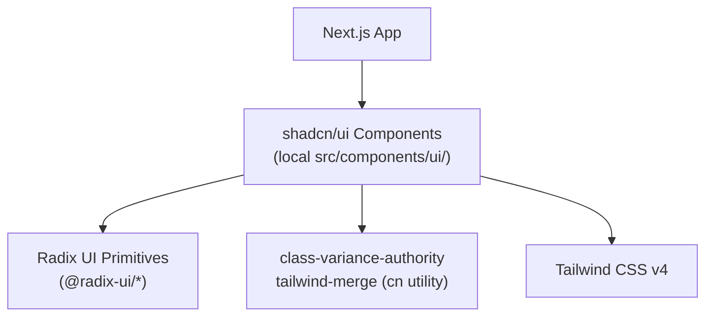

# Design: Refactor Components to shadcn/ui

## Architecture Overview

Replace hand-rolled Tailwind CSS class patterns with shadcn/ui composable components. shadcn/ui provides unstyled, accessible primitives built on Radix UI, styled with Tailwind CSS via `class-variance-authority` and `tailwind-merge`. Components are added via CLI as local source files so they are fully customizable.

## Data Models

No new data models — existing TypeScript interfaces remain unchanged. The refactor is purely presentational.

## Component / Module Map

### shadcn/ui Components to Install

| Component | Replaces | Rationale |
|-----------|----------|-----------|
| `Button` | All `<a>` and `<button>` elements with manual styles | Consistent sizing, variants (default/outline/ghost), loading state, disabled styling |
| `Card` / `CardHeader` / `CardContent` | Manual `rounded-xl border bg-white p-8` divs | Structured card layout with semantic slots |
| `Badge` | Manual status pills (e.g., health indicator) | Consistent color variants |
| `Input` | `<input>` elements | Consistent sizing, focus ring, error state |
| `Select` | Native `<select>` in ChatModeSelector | Styled dropdown with same look across browsers |
| `Sheet` or `Dialog` | (future) modals and slide-overs | Accessible dialogs with focus trapping |
| `Alert` | Error message divs in ChatInterface | Structured error display with icon slot |
| `Skeleton` | Manual `animate-pulse` divs | Consistent loading placeholder |

### Existing Components to Refactor

| File | Current Pattern | shadcn Replacement |
|------|----------------|--------------------|
| `src/components/hero.tsx` | Raw `<a>` with manual classes | `Button` (variant="default" and "outline") |
| `src/components/features.tsx` | Manual card divs | `Card` + `CardHeader` + `CardContent` |
| `src/components/pricing.tsx` | Manual card divs | `Card` + `CardContent` |
| `src/components/chat/HealthIndicator.tsx` | Manual styled div with color classes | `Badge` (variant based on status) |
| `src/components/chat/ChatInput.tsx` | Raw `<input>` | `Input` |
| `src/components/chat/ChatModeSelector.tsx` | Native `<select>` | `Select` |
| `src/components/chat/ChatInterface.tsx` | Manual error div | `Alert` |
| `src/components/chat/MessageList.tsx` | Manual `animate-pulse` div | `Skeleton` |
| `src/components/contact.tsx` | Custom form elements | `Input`, `Button` |
| `src/components/footer.tsx` | Static links (minimal change) | No shadcn needed |
| `src/components/header.tsx` | Navigation links | No shadcn needed |
| `src/components/stats.tsx` | Stats grid with manual styles | `Card` |
| `src/components/testimonials.tsx` | Quote cards | `Card` |
| `src/components/faq.tsx` | Accordion-style divs | `Accordion` (from shadcn) |
| `src/components/RagPanel.tsx` | Custom panel | `Card` + `ScrollArea` (from shadcn) |

## API Contracts

No API changes — the refactor is frontend-only.

## Error Handling Strategy

- **TypeScript compile-time errors** for missing/invalid props (FR-005, FR-006)
- **Browser feature detection** for graceful degradation (FR-007)
- **CSS fallback variables** for missing theme tokens (FR-008)
- **shadcn components handle their own aria/accessibility** — no custom a11y logic needed

## Data Flow

No data flow changes. The shadcn refactor is a one-to-one replacement of rendered HTML with equivalent shadcn composable components. All event handlers, hooks, and state management remain untouched.
